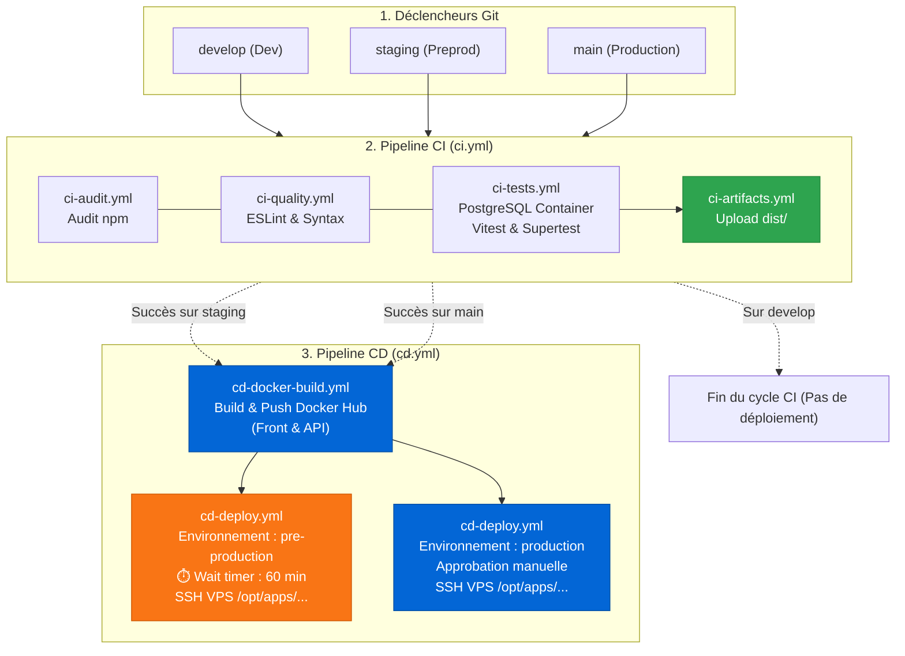

# 🌌 Saint Seiya - Cards Collection

[](https://github.com/DogeBloxy/cards-collection/actions/workflows/ci.yml?query=branch%3Adevelop)

Site web de collection de cartes sur l'univers mythique des **Chevaliers du Zodiaque (Saint Seiya)**.  
Ce projet intègre une chaîne d'intégration et de déploiement continus (**CI/CD**) entièrement automatisée et modulaire avec **GitHub Actions**, **Docker** et **PostgreSQL**.

---

## Architecture Technique

```
cards-collection/
├── Frontend (SPA React 19 + Vite 7 + Nginx Alpine)
│   ├── src/                         # Composants & Vues (Cards, SearchForm, Context)
│   ├── src/Card.test.js             # Tests unitaires Vitest
│   ├── Dockerfile                   # Build multi-stage (Builder Node 20 ➔ Image Nginx)
│   └── nginx.conf                   # Configuration reverse proxy & SPA fallback
│
├── Backend (API Express 5 + Sequelize 6)
│   ├── api/controllers/             # Logique métier CRUD
│   ├── api/models/                  # Modèle Sequelize Card
│   ├── api/seeders/                 # Initialisation automatique des héros Saint Seiya
│   ├── api/tests/                   # Tests d'intégration API (Supertest + PostgreSQL)
│   ├── api/config/database.js       # Driver multi-SGBD (SQLite dev / PostgreSQL CI & Prod)
│   └── api/Dockerfile               # Conteneur léger Node.js 20 Alpine
│
└── CI/CD (.github/workflows/)
    ├── ci.yml                       # Pipeline CI Orchestrateur
    ├── ci-audit.yml                 # Audit de sécurité des dépendances (npm audit)
    ├── ci-quality.yml               # Qualité & Linter (ESLint & Node syntax check)
    ├── ci-tests.yml                 # Tests automatisés avec conteneur de service PostgreSQL
    ├── ci-artifacts.yml             # Compilation et archivage du livrable frontend dist/
    ├── cd.yml                       # Pipeline CD Orchestrateur (déclenché post-CI)
    ├── cd-docker-build.yml          # Build & Push multi-images sur Docker Hub
    └── cd-deploy.yml                # Déploiement distant VPS par SSH dans dossier isolé
```

---

## Schéma du Pipeline CI/CD



---

## Stratégie des Environnements & Branches

| Environnement | Branche Git | Cycle CI | Cycle CD | Règles de Protection GitHub |
| :--- | :--- | :--- | :--- | :--- |
| **Développement** | `develop` | Complet | Aucun | Déploiement désactivé sur develop |
| **Pré-production** | `staging` | Complet | Automatique | **Wait timer : 60 minutes** avant exécution du déploiement |
| **Production** | `main` | Complet | Manuel | **Required reviewers** (approbation manuelle obligatoire) |

---

## Fonctionnalités du Workflow CI

1. **Audit des dépendances (`ci-audit.yml`)** :
   - Analyse des vulnérabilités de sécurité sur le Frontend et l'API (`npm audit`).
   - Mode tolérant avec `continue-on-error: true` pour inspecter les rapports dans les logs sans bloquer le pipeline.

2. **Qualité du code (`ci-quality.yml`)** :
   - Linter Frontend avec **ESLint** (règles React 19, hooks et rafraîchissement rapide).
   - Vérification de la syntaxe Node.js sur les contrôleurs, modèles et routes de l'API.

3. **Gestion du cache** :
   - Mise en cache centralisée des dépendances npm (`~/.npm`) via `actions/setup-node@v4` ciblant `package-lock.json` et `api/package-lock.json`.

4. **Tests automatisés & Service PostgreSQL (`ci-tests.yml`)** :
   - Démarrage d'un conteneur de service **PostgreSQL 16 Alpine** avec sonde de disponibilité (`pg_isready`).
   - Exécution des tests unitaires Frontend avec **Vitest** (filtrage des chevaliers, rareté SSR, recherche).
   - Exécution des tests d'intégration Backend avec **Supertest** et auto-seeding des 8 cartes de base (Pégase Seiya, Lion Aiolia, Camus, Phénix Ikki, etc.).

5. **Génération d'artefacts (`ci-artifacts.yml`)** :
   - Compilation des assets de production (`npm run build`).
   - Archivage du bundle `frontend-dist` disponible au téléchargement pendant 7 jours.

---

## Fonctionnalités du Workflow CD

1. **Images Docker (`cd-docker-build.yml`)** :
   - Image Frontend : Multi-stage build Nginx Alpine exposant le port `80`.
   - Image Backend : Image légère Node.js 20 Alpine exposant le port `3000`.
   - Publication conjointe sur le registre **Docker Hub** taguée selon la branche (`staging`, `prod`) et le SHA du commit.

2. **Déploiement distant VPS par SSH (`cd-deploy.yml`)** :
   - Connexion SSH automatisée avec `appleboy/ssh-action`.
   - Isolation stricte des applications sur le serveur dans `/opt/apps/cards-collection-<environnement>/`.
   - Commandes exécutées : pull des nouvelles images, redémarrage `docker compose up -d --remove-orphans`, et nettoyage des anciennes images avec `docker image prune -f`.
   - Mécanisme de repli pédagogique (simulation) si les accès SSH ne sont pas configurés.

---

## Configuration des Secrets & Environnements GitHub

### Secrets requis dans GitHub (`Settings > Secrets and variables > Actions`) :
* `DOCKERHUB_USERNAME` : Nom d'utilisateur Docker Hub.
* `DOCKERHUB_TOKEN` : Token d'accès personnel Docker Hub.
* `SSH_HOST` : Adresse IP ou domaine du serveur VPS.
* `SSH_USER` : Utilisateur SSH (ex: `ubuntu`, `debian`).
* `SSH_KEY` : Clé privée SSH autorisée.

### Configuration des Environnements (`Settings > Environments`) :
1. **`pre-production`** :
   - Activer la règle **Wait timer** et la fixer à **60 minutes**.
2. **`production`** :
   - Activer la règle **Required reviewers** et sélectionner les membres autorisés à valider la mise en production.

---

## Démarrage Local

### Prérequis
* Node.js >= 20.x
* npm >= 10.x

### 1. Démarrer l'API Backend
```bash
cd api
npm install
npm run dev
```

### 2. Démarrer le Frontend
```bash
npm install
npm run dev
```

### 3. Lancer les tests localement
```bash
npm test
cd api && npm test
```
